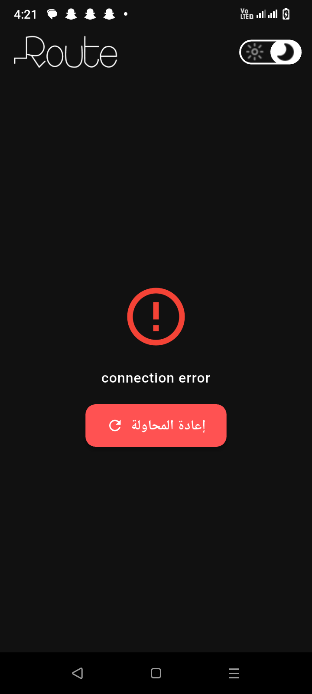
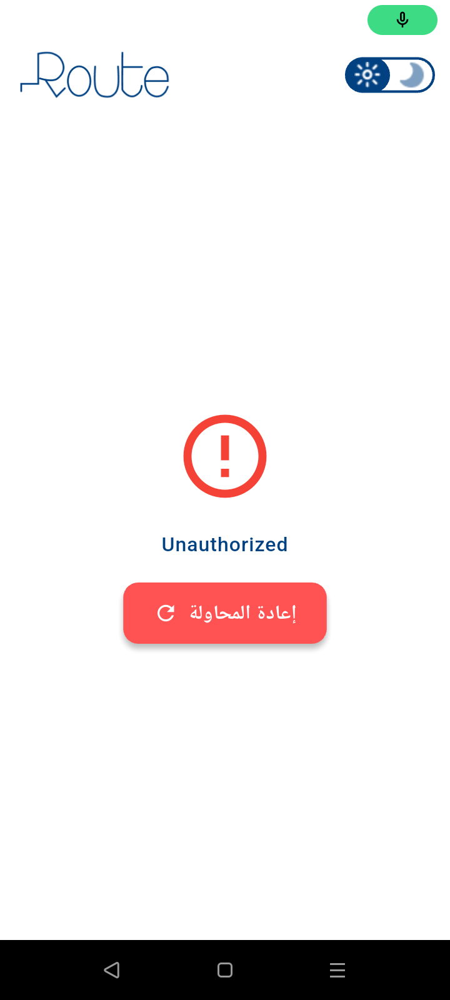

Photo List Screen (Online - Light Mode):

Photo List Screen (Online - Dark Mode):

Photo List Screen (Offline/Cached - Light Mode):

Photo List Screen (Offline/Cached - Dark Mode):

Loading State:

Error State:

Network Status Indicator:

/lib
├── /core                      ← Shared app logic
│   ├── /api_service           ← API integration layer
│   │   ├── api_service.dart   ← Wrapper for HTTP (e.g., Dio)
│   │   └── api_constants.dart ← Base URLs, paths, headers
│   ├── /network               ← Internet connection checker
│   │   └── connection_checker.dart
│   ├── /constants             ← Shared constant values
│   ├── /theme                 ← App themes (light/dark)
│   ├── /assets                ← Asset path constants
│   ├── /di                   ← Dependency injection setup (e.g., GetIt)
│   ├── /routes                ← Navigation and route names
│   ├── /widgets               ← Custom reusable UI widgets
│   ├── /helpers               ← Utility functions
│   └── /failure               ← Error handling (Failure, Exception classes)
│   └── /hive               ← Error handling (Failure, Exception classes)
│   └── /view_model               ← Error handling (Failure, Exception classes)

└── /feature                   ← Modular features (screens)
    ├── /splash
    │   └── /presentation
    │       ├── /view          ← splash_screen.dart
    │       └── /view_model    ← splash_view_model.dart
    │
    └── /home
        ├── /data
        │   ├── /models        ← Dart models (e.g., Photo)
        │   ├── /repo          ← Repository implementations
        │   └── /data_source   ← Remote/local data fetching
        └── /presentation
            ├── /view          ← UI screens and widgets
            └── /view_model    ← State management and logic
Clean Architecture Layer Responsibilities
    feature folder :
        1. Presentation Layer
           Location: /feature/home_screen/presentation/
           Location: /feature/splash_screen/presentation/
        
            /view: Flutter widgets and screens — shows data to the user.
            
            /view_model: Manages UI state and business logic, and calls repositories.
            
            !- Presentation layer does not access APIs or databases directly.
        2. Data Layer
           Location: /feature/home_screen/data/
        
            /models: Data classes (e.g., Photo, User) used to parse JSON or DB data.
            
            /data_source: Communicates with external sources (e.g., API, Hive DB).
            
            /repo: Implements a repository that decides where data should come from (API or local).
                   and contain feature functions 
            
            !- Repositories act as a middleman between ViewModels and raw data sources.
    core folder:
        1. Core Layer
           Location: /core/
        
            Shared and reusable code.
            
            Example folders:
            
            api_service/: API calls and base URL definitions.
            
            network/: Internet connectivity checks.
            
            failure/: Standardized error handling.
            
            di/: Dependency injection (e.g., GetIt registration).
            
            routes/, widgets/, helpers/: Support navigation and UI.
o Documentation on how to set up and run the project locally, including any necessary 
flutter pub get or flutter pub run build_runner commands, and any other important setup steps.
    o flutter pub get => to get  dependencies
    o flutter pub run build_runner build --delete-conflicting-outputs => Generate all injectable & hive code
