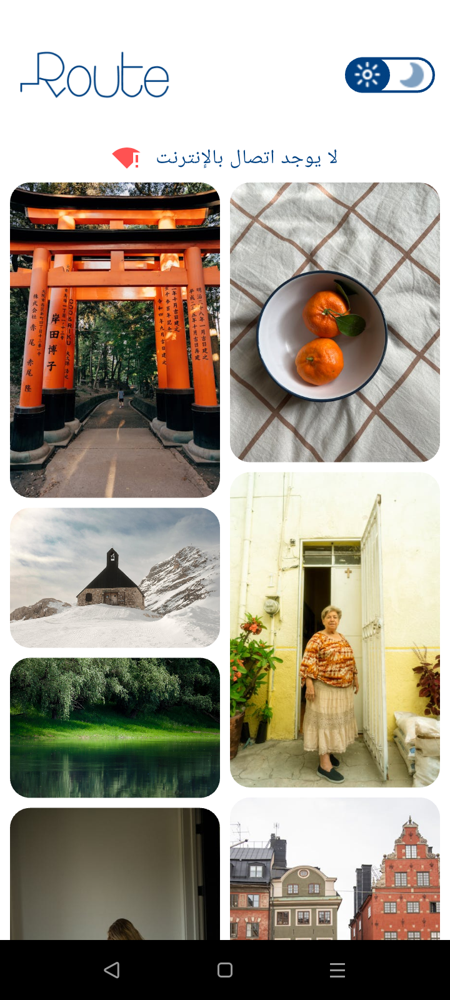
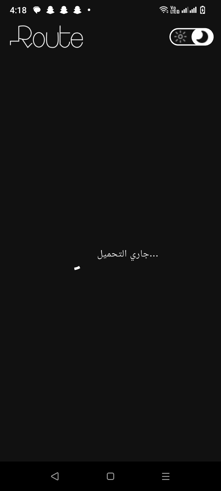

# 📸 Flutter Photo Gallery App

A modular Flutter application using Clean Architecture to display a curated list of photos with offline support, light/dark themes, and loading/error states.

---

## 📷 Screenshots

### 🟢 Online Mode

**Light Mode:**


**Dark Mode:**


### 🔴 Offline (Cached) Mode

**Light Mode:**



**Dark Mode:**


### 🔄 Loading State




### ❌ Error State


### 📡 Network Status Indicator


---

## 🧱 Project Structure

```
/lib
├── /core
│   ├── /api_service           → API service and constants
│   ├── /network               → Internet connection checking
│   ├── /constants             → Shared constant values
│   ├── /theme                 → Light/Dark theme configs
│   ├── /assets                → Asset path references
│   ├── /di                    → Dependency injection (GetIt + Injectable)
│   ├── /routes                → Named routes for navigation
│   ├── /widgets               → Reusable custom widgets
│   ├── /helpers               → Helper functions
│   ├── /failure               → App-wide failure/error types
│   ├── /hive                  → Hive-related utilities (optional)
│   └── /view_model            → Shared or core-level view models (optional)
│
└── /feature
    ├── /splash
    │   └── /presentation
    │       ├── /view          → splash_screen.dart
    │       └── /view_model    → splash_view_model.dart
    │   /display_image
    │   └── /presentation
    │       ├── /view          → display_imagen.dart    
    └── /home
        ├── /data
        │   ├── /models        → Data models (e.g., Photo)
        │   ├── /repo          → Repository implementations
        │   └── /data_source   → API/Hive data sources
        └── /presentation
            ├── /view_model    → Logic and state management
            └── /view          → UI widgets and screens
```

---

## 🧠 Clean Architecture Overview

### 🧩 Feature Layer

Each feature (e.g., `home`, `splash`) includes:

#### 1. Presentation Layer
- **Location:** `/feature/[feature_name]/presentation/`
- **/view:** Displays UI (Flutter widgets)
- **/view_model:** Handles business logic and state (uses repository)

> ❗ Presentation does **not** directly call APIs or databases.

#### 2. Data Layer
- **Location:** `/feature/[feature_name]/data/`
- **/models:** Dart models (e.g., `Photo`)
- **/data_source:** Handles remote (Dio) or local (Hive) access
- **/repo:** Abstracts data source access and provides feature logic

> 🧠 Repositories act as a **middleman** between ViewModels and raw data sources.

---

### 🛠 Core Layer

**Location:** `/core/`  
Contains shared services, constants, and utilities:

| Folder             | Purpose                                 |
|--------------------|------------------------------------------|
| `api_service/`      | Handles Dio HTTP requests + constants   |
| `network/`          | Checks internet connectivity            |
| `di/`               | Sets up dependency injection            |
| `failure/`          | Defines app-wide error handling         |
| `routes/`           | Global route management                 |
| `widgets/`, `helpers/` | Shared UI and utility functions     |

---

## 🚀 Getting Started (Local Setup)

Follow these steps to set up and run the project locally:

### 🔹 1. Install dependencies

```bash
flutter pub get
```

### 🔹 2. Run code generation

Generates all `injectable`, `hive`, and `build_runner`-based files:

```bash
flutter pub run build_runner build --delete-conflicting-outputs
```

### 🔹 3. Run the app

```bash
flutter run
```

> ✅ Make sure Hive is initialized in `main.dart` and all adapters are registered.

---

## 📦 Tech Stack

- `flutter_bloc` for state management
- `injectable` + `get_it` for DI
- `hive` for local cache
- `dio` for network calls
- `dartz` for functional error handling
- `connectivity_plus` for network checks

---

## 📌 Notes

- All layers are **loosely coupled** and follow **Clean Architecture**.
- Adding a new feature is as simple as creating a new `/feature/xyz` module with `data` and `presentation`.

---
## 📲 Gallery App – Full App Flow Description

This document outlines the full data flow of the Gallery App. The app supports both online and offline image browsing using the Pexels API and Hive for local caching. It also includes a splash screen, error handling, and clean architecture principles.

---

### 1. Splash Screen

- When the app launches, it first displays a **splash screen**.
- The splash screen remains visible for **3 seconds**.
- After the delay, the app navigates automatically to the **Home Screen**.

---

### 2. Home Screen – Initial Load

- Upon entering the Home Screen, the app shows a **loading indicator** while performing setup tasks.
- These tasks are managed by a ViewModel (or Controller), which starts the image-fetching process.

---

### 3. Network Connection Check

- The app checks for internet availability using the `connectivity_plus` package.
- Based on the result, the app determines whether to fetch data from the remote API or load it from local storage.

---

### 4. Fetching Photo Data

#### If the device is **online**:
- The app calls the remote data source to **fetch images from the Pexels API**.
- After fetching, it parses and converts the data into model objects.
- The fetched data is also **cached in Hive** for offline access in future sessions.
- The app then displays the images on the UI.

#### If the device is **offline**:
- The app attempts to **load previously cached data from Hive**.
- If data is available in Hive, it is displayed on the UI.

---

### 5. Error Handling

- If an error occurs during:
    - API request
    - Hive read/write
    - Data parsing
- The app **navigates to an error screen**.
- The error screen displays a user-friendly message and may offer retry options.

---

### 6. Displaying Photos

- If data fetching (from API or Hive) is successful:
    - The ViewModel updates its state.
    - The UI listens to the ViewModel and displays a **grid of images** using a layout like `GridView`.

---

### Summary

- The app starts with a 3-second splash screen.
- The Home Screen checks for internet connectivity.
- If connected, it fetches data from the API and caches it locally.
- If offline, it loads data from the Hive cache.
- If any step fails, the app navigates to a dedicated error screen.
- Throughout this process, the app uses a loading indicator to provide feedback to the user.
